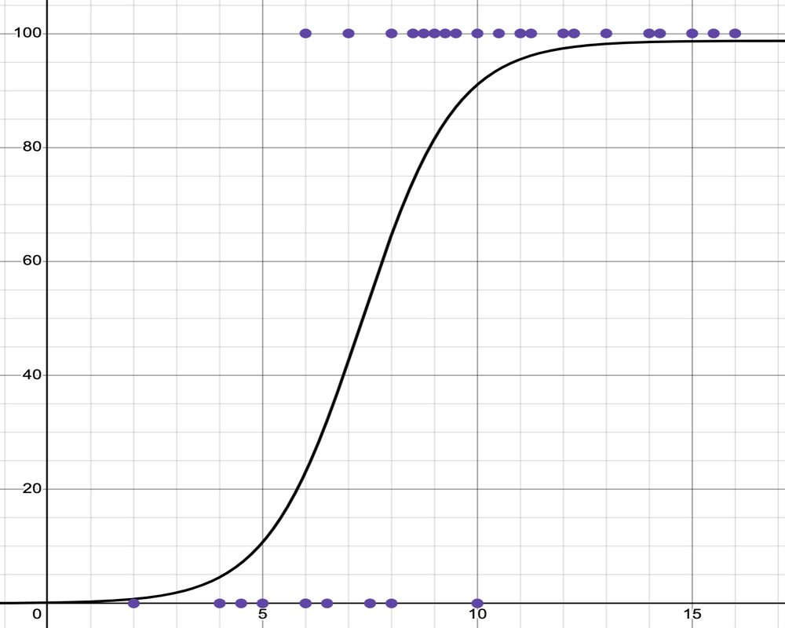
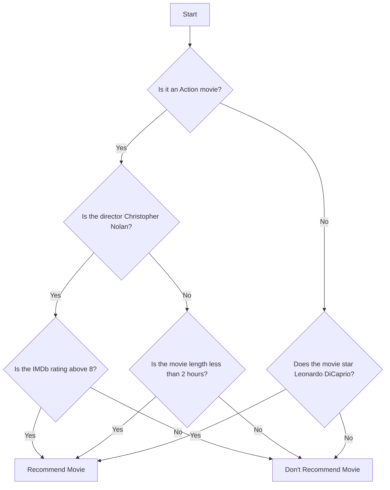

<h1>Machine Learning</h1>

**CS 210, Intro to AI Programming**

| Topics                                                       |                           |
| ------------------------------------------------------------ | ------------------------- |
| 1. What is AI, Python                                        | 6. ANN: Image recognition |
| 2.  Symbolic AI: rule-based                                  | 7. Generative AI          |
| 3.  <mark>Classical Machine Learning: Bayes' Rule</mark>     | 8. Custom chatbot         |
| 4. Classical Machine Learning: Scikit Learn Part 1           | 9. LLM fine-tuning        |
| 5. Classical Machine Learning: Scikit Learn Part 2 Midterm | 10. Ethics                |
|                                                              | 11. Final                 |

<h2>Table of Contents</h2>

[TOC]

## Introduction

Machine learning is a subfield of AI that uses models trained on data sets. These models are capable of <u>predicting</u> outcomes and <u>classifying</u> information. A special type of Machine Learning is Generative AI which can <u>generate</u> text, images and more.

## Models

When talking about Machine Learning (ML), people often use the term *model*. This term can refer to either:

-  A machine learning algorithm and the methodology for training it.
- A machine learning algorithm that has been trained using data.

**Example of a model:** The *naive Bayes classifier* for detecting spam assigns weights (probabilities) to words in a set of words. This set of weights along with the algorithm for using them to classify an email message constitute a trained *model*.

## Types of ML

### Supervised learning 

An AI system is trained using labeled data; which means the data has been categorized in some way to indicate what it represents. 

**Example**: email spam detection.

A model is trained on emails that have already been classified as spam or not spam. After training, the model can be used to classify new emails as either spam or not spam.

### Unsupervised learning

The system is trained on *unlabeled data* and tries to find similarities, differences, patterns, and structure in data by itself. The system will then classify the samples in other data sets according to the categories inferred from the training data.

**Example:** customer segmentation in marketing. 

A business might use data about their customers, such as age, location, and purchasing behavior to determine which customers are similar to each other. Unsupervised learning algorithms, such as *k-means clustering*, can be used to automatically find patterns in this data and group similar customers together.

### Reinforcement learning

The AI system isn't given any training data, instead it acts as an autonomous agent that accumulates data from trial-and-error attempts to solve a problem or make a decision. It uses algorithms that learn from outcomes to decide which action to take next. 

**Example:** autonomous robots in industrial automation. 

Industrial robots can be programmed to perform tasks such as picking up objects or assembling parts. The robots start with little to no knowledge about how to perform these tasks. As a robot attempts to perform a task, it is given positive rewards for successful actions (like correctly assembling a part) and negative rewards for unsuccessful actions (like dropping an object). Over time, the robots learn to perform their tasks more efficiently by maximizing their successes and minimizing their mistakes. This is all done without explicit programming for each specific task.

## Supervised Learning Models

We've already mentioned Bayes' rule, which is a statistical methodology (aka model). Here are some others. These can be used for *prediction* and/or *classification*.

### Nearest Neighbors (K-NN)

K-NN, where K represents the number of "Nearest Neighbors" to consider is a methodology in which things (or people) are classified based on a number of predetermined features and grouped (classified) based on the similarity of those features.

**Example:** Real estate comparative market analysis.

Training: A realtor compares the recent selling price of homes similar to the one they are selling and sets a selling price based on those similar homes. In order to train an ML model to do this, the pertinent characteristics of a home (location, number of beds and baths, etc.) need to be identified and represented numerically so that they can be compared mathematically.

Inference (classification in this case): A home that hasn't sold yet can have its market value estimated by comparing it to several (k) other homes with similar characteristics (Nearest Neighbors).

**Example:** Character recognition.

  
What do you think the steps would be to train a model for Handwritten Character Recognition (HCR) using the <a href="https://en.wikipedia.org/wiki/MNIST_database">MNIST data set</a>? (Click to expand)

<h4>Training the Model</h4>
<ul>
  <li><b>Data Collection:</b> Gather a large dataset of handwritten characters, each labeled with their correct character (such as the MNIST).</li>
  <li><b>Feature Extraction:</b> Convert each handwritten character into a <i>feature vector</i>. The features could include pixel locations, corner coordinates, location and nmuber of open spaces enclosed by loops, etc.</li>
  <li><b>Model Training:</b> The K-NN algorithm doesn’t require an explicit training step. Instead, it stores all the feature vectors and their corresponding labels.</li>
</ul>
<h4>Classification Using the Trained Model</h4>
<ul>
  <li><b>New Character Introduction:</b> When a new, unknown handwritten character is introduced, convert it into a feature vector using the same method used during training.</li>
  <li><b>Distance Calculation:</b> The K-NN algorithm calculates the distance between the new character and all the known characters in the training set.</li>
  <li><b>Finding Nearest Neighbors:</b> The algorithm identifies the ‘k’ (some number) closest known characters to the new character.</li>
  <li><b>Majority Voting:</b> The new character is assigned the label that is most common among its ‘k’ nearest neighbors.</li>
</ul>

### Statistical Models

These models use mathematical statistics for prediction and/or classification.

#### Bayesian Models

We have already discussed an application of naïve Bayes classification (email spam detection). 

#### Regression

##### Linear Regression  

Linear regression is a statistical tool used to predict a relationship between two continuous variables by finding the best-fitting straight line through the data.

**The Equation of a Line**

The core of linear regression uses the simple algebraic equation for a straight line:

*y = mx + b*

- y&mdash;The *predicted value* (the outcome we want to know).
- x&mdash;The *input value* (the data we use for prediction).
- m&mdash;The *slope*. It shows how much *y* changes for every one-unit change in *x*.
- b&mdash;The *y-intercept*. It's the predicted value of *y* when *x* is zero.

**Simple Example: Predicting Sales** 

Imagine a company wants to predict the number of sales (y) based on the money spent on advertising (x) in a given week.

Suppose the regression calculation yields the line:

**Sales = 2 * Advertising Spend + 50**  
 *m* = 2 (slope) and *b* = 50 (y-intercept).

This means for every extra dollar spent on advertising, the company predicts an increase of 2 sales. If the company spends $100 on advertising, the predicted sales are:

Sales = 2(100) + 50 = 250

- Data Points: Scattered dots on the chart represent the actual historical sales data (e.g., a dot at (50, 150) means $50 of ad spend resulted in 150 sales).

- Regression Line: A straight line is drawn through the middle of these dots. This line represents the equation *y = mx + b* (our prediction model) and is used to estimate sales for any amount of advertising spend.

##### Logistic Regression

Logistic regression (logarithmic odds regression) is a methodology used mainly for binary classification. It predicts the probability that an instance belongs to a given class. For example, it can be used to identify whether an email is spam or not, or to diagnose diseases by assessing the presence or absence of specific conditions based on patient test results. 

In binary logistic regression, a curve is produced by a mathematical function called a *sigmoid function* which squeezes output values into a range between 0 and 1 in a smooth and gradual manner. It’s like a soft switch: instead of abruptly turning ON or OFF, it gradually transitions between the two states.

In the example below, the input, on the x-axis, is the number of hours students studied for an exam. The output, on the y-axis, is probability of passing the exam.

[logistic regression graph on Desmos](https://www.desmos.com/calculator/zxs34s4tbd)

**Other types of logistic regression**

Besides *binary* logistic regression, where data are classified into two categories there are other types of logistic regression that classify data into more than two categories.

- **Multinomial:** There can be 3 or more possible *unordered* categories, such as “cats”, “dogs”, or "sheep".
- **Ordinal:** There can be 3 or more possible *ordered* categories, such as “low”, “Medium”, or "High".

### Tree-Based Models

#### Decision Trees

A *decision tree* is a flowchart-like structure where each *internal node* (aka *decision node*) represents a point where a decision is made based on a rule related to some feature (aka attribute) of the data item being classified. There is a branch for each outcome of the decision. A branch or series of branches will ultimately end in a *leaf node* that represents a final outcome.

The tree is built by a machine learning training algorithm. The ML algorithm works off of labeled data (this is supervised ML) to find features which it turns into conditions for making a decision at the decision nodes in the tree.

**Movie recommendation example**

Start with a dataset of movies that a person likes.

1. **Feature extraction**: For each movie in the dataset, there are features, such as genre, director, length, and so on. These features are used to create the “questions” in the decision tree.
2. **Tree construction**: The decision tree training algorithm builds a decision tree based on the features
3. **Prediction**: When recommending a new movie, the decision tree algorithm uses these features to traverse the tree. At each decision node, it checks the feature of the movie and follows the corresponding branch. This process continues until it reaches a leaf node, which gives the final prediction (e.g., “the user will like this movie” or “the user will not like this movie”).
4. **Recommendation**: The system can then recommend the movies that were predicted to be liked by the user.

#### Random Forests

A Random Forest is a collection of Decision Trees. Each tree in the forest is built from a more or less random sample from the training data set. The final prediction of the Random Forest is made by averaging the predictions of each individual tree (for regression tasks) or by taking a majority vote (for classification tasks). This approach helps to overcome the overfitting problem of Decision Trees and generally results in a more robust and accurate model.

### Artificial Neural Networks

An Artificial Neural Network (ANN) is a computational model inspired by the structure and function of neural networks in the brains. It consists of interconnected nodes or artificial neurons, which loosely model the neurons in a brain. These are connected in a way that models the synapses in a brain. Each artificial neuron receives signals from connected neurons, processes them, and sends a signal to other connected neurons. The strength of the signal at each connection is determined by a weight, which is adjusted during the learning process. They can learn from experience, and can derive conclusions from complex and seemingly unrelated sets of information.

## Reference

[10 Machine Learning Methods that Every Data Scientist Should Know](https://medium.com/towards-data-science/10-machine-learning-methods-that-every-data-scientist-should-know-3cc96e0eeee9)&mdash;Jorge Castañón, Towards Data Science on Medium, 2019.

[8 Machine Learning Models Explained in 20 Minutes](https://www.datacamp.com/blog/machine-learning-models-explained)&mdash;Natassha Selvaraj, DataCamp, 2022.

[What is supervised learning?](https://www.ibm.com/topics/supervised-learning)&mdash;IBM

[What is unsupervised learning?](https://www.ibm.com/topics/unsupervised-learning)&mdash;IBM

[What is reinforcement learning?](https://www.ibm.com/topics/reinforcement-learning)&mdash;IBM

---

 Intro to AI lecture notes by [Brian Bird](https://profbird.dev), written in 2024, revised in <time>2025</time> are licensed under a [Creative Commons Attribution-ShareAlike 4.0 International License](http://creativecommons.org/licenses/by-sa/4.0/). 

MS Copilot GPT-4 and Gemini Flash 2.5 were used to draft parts of these notes.