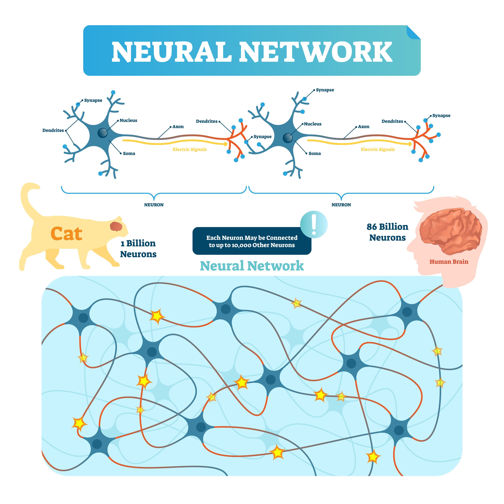
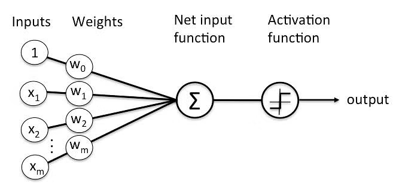
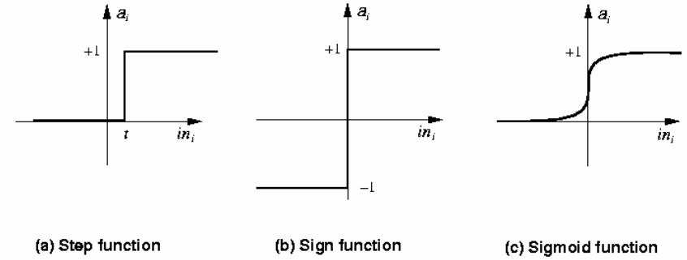
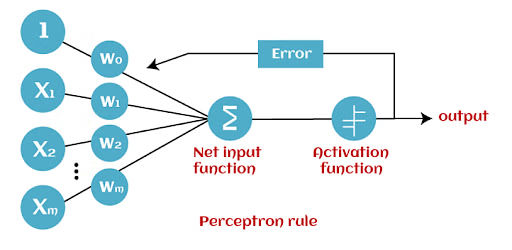

<h1>Artificial Neural Netoworks (ANNs)</h1>

**CS 210, Intro to AI Programming**

| Topics                                          |                                                              |
| ----------------------------------------------- | ------------------------------------------------------------ |
| 1. What is AI, Python                           | 6. <mark>Artificial Neural Networks: Image recognition</mark> |
| 2.  Symbolic AI: rule-based                     | 7. Generative AI                                             |
| 3.  Classical Machine Learning Bayes' Rule | 8. Custom chatbot                                            |
| 4. ML: scikit-learn Working with Data Sets | 9. LLM fine-tuning                                           |
| 5. ML: Scikit Learn Part 2                      | 10. Ethics                                                   |

<h2>Table of Contents</h2>

[TOC]

## Description

### Neural Networks in the Brain

A biological neural network consists of interconnected neurons that communicate through axons, dendrites and synapses to process and transmit information. The dendrites are inputs to the neuron and the axon is the output of the neuron. The connection points are synapses. This intricate web of connections forms the basis for learning, memory, and behavior in living organisms.

## Perceptrons

A perceptron is modeled on a single neuron. 

( &sum; is a the mathematical symbol for summation&mdash;aka addition.)

#### Mathematical Model

linear combination = intercept + weight1 × input1 + ... + weight6 × input6 (where ... is shorthand notation meaning that the sum include all the terms from 1 to 6).

- The *weights* are used as multipliers on the *inputs* of the neuron, which are added up.
- The *intercept* term is like the intercept in linear regression. This can be thought of as a fixed additional charge.

##### Activation Function

Once the linear combination has been computed, the neuron takes the linear combination and puts it through an activation function. Typical examples of the activation function include:

- Step function: if the value of the linear combination is greater than zero, send a pulse (ON), otherwise do nothing (OFF)
- Sign function: similar to the step function, but the output will be either +1 or -1.
- Sigmoid (logistic) function: a “soft” version of the step function.

### Limitations of Perceptrons

Perceptrons seemed to some, like Rosenblatt, the developer of the perceptron (1957,) to be the best way to advance the field of AI. But there were obstacles, which were publicized in detail by Minsky (who ironically developed the first neural network in 1951[^1]) and Pappert in their book *Perceptrons* (1969). These were two of the main obstacles:

- Since there was only a single layer of nodes (neurons), they could only do linear classification (much like regression or Bayesian machine learning techniques).
- There was no known way to write an algorithm for automatically learning the optimal weights for the connections.

## Artificial Neural Networks

An artificial neural network (ANN) is a computational model inspired by the structure and function of neural networks in the brain. Each node, or "neuron", has multiple inputs, but one output. The nodes are arranged in layers and are interconnected. The input layer gets input data to be processed, the hidden layers do the processing and send data to an output layer (which could have more than one node.

### Deep Learning

Techniques were developed to overcome some of the main the limitations identified by Minsky and Pappert.

- **Multiple Layers**: The term “deep” refers to the use of multiple layers in the network&mdash;the *hidden layers*. These layers transform the input data into a more abstract and composite representation that goes beyond simple linear classification.
- **Self-learning**: A number of algorithms were developed to set the weights on the connections in the ANN. One of these was Hebbian Learning, named after the psychologist Donald Hebb, it is based on a rule which states that if two neurons fire together, then the connection between them strengthens. This is often summarized as “Cells that fire together, wire together.” 

### Characteristics of ANNs

- Information processing and storage (memory) are both done in the same place instead of memory and processing being separated.
- Processing is done simultaneously (in parallel) across many neurons instead of sequentially. 

#### Discussion

- How is parallel processing in an ANN done?

  - Parallel processing in digital computers:
    - Time-slice
    - Multiple cores

  - Different types of processing units in consumer PCs:
    - CPU: typically 4 to 16 cores
    - GPU: NVIDIA GPUs can have hundreds or thousands of CUDA (Compute Unified Device Architecture) cores.
    - NPU: Typically have 10 to 20 cores.

- Where is data in an ANN stored?

  - In a biological neural network, it is stored in the neurons
  - In an ANN it is ultimately stored in the computer's memory.

## Backpropagation

One of the main breakthroughs that led to progress on ANNs was the development of *backpropagation* in 1986 by Geoffrey Hinton, who is often referred to as the "godfather of AI". 

Backpropagation, short for "backward propagation of errors," is an algorithm used to train ANNs by setting the weights on the connections. 

### Backpropagation in a Perceptron

Backpropagation is a method used set the weights and improve accuracy. This is a summary of the steps:

1. **Forward Pass**: The perceptron processes training data to produce an output.
2. **Error Calculation**: The output is compared to the actual target to find the error.
3. **Backward Pass**: The error is used to adjust the weights, reducing the error.

This process repeats until the perceptron's predictions become accurate.

### Backpropagation in an ANN

Here is a simplified summary of the steps in the algorithm:

1. **Forward Propagation**: Training data is passed through the network, from the input layer through the hidden layers to the output layer, to generate a prediction. This process is known as forward propagation.

2. **Compute Loss** (error): The prediction is compared with the actual target value to compute the loss (error). The loss function quantifies how far off the predictions are from the actual target values.

3. **Backward Propagation**: The loss is then propagated back through the network. This involves computing the gradient (slope) of the loss function with respect to the weights and biases in each layer of the network. 

4. **Update Weights and Biases**: The weights and biases of the network are updated in the opposite direction to the gradient (in the opposite direction of the error). This is done to minimize the loss. The size of the update is determined by the learning rate, a hyperparameter that controls how fast the network learns.

5. **Iterative Process**: This process is repeated for many epochs (an epoch is one pass through the entire training dataset) until the network is adequately trained and the loss is minimized.

## Reference

### Articles and Tutorials

[What is a Perceptron: A Beginners Guide for Perceptron](https://www.simplilearn.com/tutorials/deep-learning-tutorial/perceptron)&mdash;Mayank Banoula, SimpliLearn, 2023.

[Deep Learning](https://www.deeplearningbook.org/)&mdash;Ian Goodfellow, Yoshua Bengio, Aaron Courville, MIT Press, 2016

[Neural Networks and Deep Learning](http://neuralnetworksanddeeplearning.com/)&mdash;Michael A. Nielsen, Determination Press, 2015

### Interactive Web Pages

[Tensorflow Playground](http://playground.tensorflow.org/)&mdash;Tinker with a neural network in your browser.

- [Understanding neural networks with TensorFlow Playground](https://cloud.google.com/blog/products/ai-machine-learning/understanding-neural-networks-with-tensorflow-playground)&mdash;Kaz Sato, Google Cloud, 2016.

[Machine Learning Playground](https://ml-playground.com)&mdash;Experiment with multiple ML models

[Perceptron Visualizer](https://perceptrondemo.com/)

[^1]: Marvin Minsky, in collaboration with Dean Edmonds, developed the first artificial neural network in 1951, known as the Stochastic Neural Analog Reinforcement Calculator (SNARC). It was not implemented in software and did not use a computer. Its 40 artificial neurons were built with mechanical and electronic components. It was about the size of a grand piano and included a plugboard for interconnecting the neurons. It was designed for a single task: to learn a path through a maze using Hebbian Learning.

---

 Intro to AI Programming lecture notes by [Brian Bird](https://profbird.dev), written in <time>2024</time>, revised in <time>2025</time> are licensed under a [Creative Commons Attribution-ShareAlike 4.0 International License](http://creativecommons.org/licenses/by-sa/4.0/). 

Note: GPT-4 and GPT-4o were used to draft parts of these notes, July 2024.