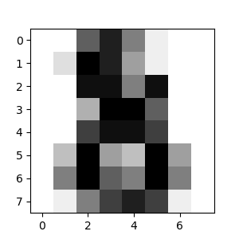

[scikit-learn tutorials index](ScikitLearnTutorials.md)

# An introduction to machine learning with scikit-learn

In this section, we introduce the [machine learning](https://en.wikipedia.org/wiki/Machine_learning) vocabulary that we use throughout scikit-learn and give a simple learning example.

To run the code in this tutorial, you must first install scikit-learn and all of its required dependencies. Please refer to the [installation instructions page](https://scikit-learn.org/1.7/install.html#installation-instructions) for more information and for system-specific instructions.

## Machine learning: the problem setting

In general, a learning problem considers a set of n [samples](https://en.wikipedia.org/wiki/Sample_(statistics)) of data and then tries to predict properties of unknown data. If each sample is more than a single number and, for instance, a multi-dimensional entry (aka [multivariate](https://en.wikipedia.org/wiki/Multivariate_random_variable) data), it is said to have several attributes or **features**.

Learning problems fall into a few categories:

- [supervised learning](https://en.wikipedia.org/wiki/Supervised_learning), in which the data comes with additional attributes that we want to predict ([Click here](https://scikit-learn.org/1.7/supervised_learning.html#supervised-learning) to go to the scikit-learn supervised learning page).This problem can be either:
  - [classification](https://en.wikipedia.org/wiki/Classification_in_machine_learning): samples belong to two or more classes and we want to learn from already labeled data how to predict the class of unlabeled data. An example of a classification problem would be handwritten digit recognition, in which the aim is to assign each input vector to one of a finite number of discrete categories.  Another way to think of classification is as a discrete (as opposed to continuous) form of supervised learning where one has a limited number of categories and for each of the n samples provided, one is to try to label them with the correct category or class.
  - [regression](https://en.wikipedia.org/wiki/Regression_analysis): if the desired output consists of one or more continuous variables, then the task is called *regression*. An example of a regression problem would be the prediction of the length of a salmon as a function of its age and weight.
- [unsupervised learning](https://en.wikipedia.org/wiki/Unsupervised_learning), in which the training data consists of a set of input vectors x without any corresponding target values. The goal in such problems may be to discover groups of similar examples within the data, where it is called [clustering](https://en.wikipedia.org/wiki/Cluster_analysis), or to determine the distribution of data within the input space, known as [density estimation](https://en.wikipedia.org/wiki/Density_estimation), or to project the data from a high-dimensional space down to two or three dimensions for the purpose of *visualization* ([Click here](https://scikit-learn.org/1.7/unsupervised_learning.html#unsupervised-learning) to go to the Scikit-Learn unsupervised learning page).

Training set and testing set

Machine learning is about learning some properties of a data set and then testing those properties against another data set. A common practice in machine learning is to evaluate an algorithm by splitting a data set into two. We call one of those sets the **training set**, on which we learn some properties; we call the other set the **testing set**, on which we test the learned properties.

## Loading an example dataset

`scikit-learn` comes with a few standard datasets, for instance the [iris](https://en.wikipedia.org/wiki/Iris_flower_data_set) and [digits](https://archive.ics.uci.edu/dataset/683/mnist+database+of+handwritten+digits) datasets for classification and the [diabetes dataset](https://www4.stat.ncsu.edu/~boos/var.select/diabetes.html) for regression.

In the following, we start a Python interpreter from our shell and then load the `iris` and `digits` datasets.  Our notational convention is that `$` denotes the shell prompt while `>>>` denotes the Python interpreter prompt:

```python
from sklearn import datasets
iris = datasets.load_iris()
digits = datasets.load_digits()
```

A dataset is a dictionary-like object that holds all the data and some metadata about the data. This data is stored in the `.data` member, which is a `n_samples, n_features` array. In the case of supervised problems, one or more response variables are stored in the `.target` member. More details on the different datasets can be found in the [dedicated section](https://scikit-learn.org/1.7/datasets.html#datasets).

For instance, in the case of the digits dataset, `digits.data` gives access to the features that can be used to classify the digits samples:

```python
print(digits.data)
[[ 0.   0.   5. ...   0.   0.   0.]
 [ 0.   0.   0. ...  10.   0.   0.]
 [ 0.   0.   0. ...  16.   9.   0.]
 ...
 [ 0.   0.   1. ...   6.   0.   0.]
 [ 0.   0.   2. ...  12.   0.   0.]
 [ 0.   0.  10. ...  12.   1.   0.]]
```

and `digits.target` gives the ground truth for the digit dataset, that is the number corresponding to each digit image that we are trying to learn:

```python
digits.target
array([0, 1, 2, ..., 8, 9, 8])
```

Shape of the data arrays

The data is always a 2D array, shape `(n_samples, n_features)`, although the original data may have had a different shape. In the case of the digits, each original sample is an image of shape `(8, 8)` and can be accessed using:

```python
digits.images[0]
array([[  0.,   0.,   5.,  13.,   9.,   1.,   0.,   0.],
       [  0.,   0.,  13.,  15.,  10.,  15.,   5.,   0.],
       [  0.,   3.,  15.,   2.,   0.,  11.,   8.,   0.],
       [  0.,   4.,  12.,   0.,   0.,   8.,   8.,   0.],
       [  0.,   5.,   8.,   0.,   0.,   9.,   8.,   0.],
       [  0.,   4.,  11.,   0.,   1.,  12.,   7.,   0.],
       [  0.,   2.,  14.,   5.,  10.,  12.,   0.,   0.],
       [  0.,   0.,   6.,  13.,  10.,   0.,   0.,   0.]])
```

The [simple example on this dataset](https://scikit-learn.org/1.7/auto_examples/classification/plot_digits_classification.html#sphx-glr-auto-examples-classification-plot-digits-classification-py) illustrates how starting from the original problem one can shape the data for consumption in scikit-learn.

Loading from external datasets

To load from an external dataset, please refer to [loading external datasets](https://scikit-learn.org/1.7/datasets/loading_other_datasets.html#external-datasets).

## Learning and predicting

In the case of the digits dataset, the task is to predict, given an image, which digit it represents. We are given samples of each of the 10 possible classes (the digits zero through nine) on which we *fit* an [estimator](https://en.wikipedia.org/wiki/Estimator) to be able to *predict* the classes to which unseen samples belong.

In scikit-learn, an estimator for classification is a Python object that implements the methods `fit(X, y)` and `predict(T)`.

An example of an estimator is the class `sklearn.svm.SVC`, which implements [support vector classification](https://en.wikipedia.org/wiki/Support_vector_machine). The estimator’s constructor takes as arguments the model’s parameters.

For now, we will consider the estimator as a black box:

```python
from sklearn import svm
clf = svm.SVC(gamma=0.001, C=100.)
```

Choosing the parameters of the model

In this example, we set the value of `gamma` manually. To find good values for these parameters, we can use tools such as [grid search](https://scikit-learn.org/1.7/modules/grid_search.html#grid-search) and [cross validation](https://scikit-learn.org/1.7/modules/cross_validation.html#cross-validation).

The `clf` (for classifier) estimator instance is first fitted to the model; that is, it must *learn* from the model. This is done by passing our training set to the `fit` method. For the training set, we’ll use all the images from our dataset, except for the last image, which we’ll reserve for our predicting. We select the training set with the `[:-1]` Python syntax, which produces a new array that contains all but the last item from `digits.data`:

```python
clf.fit(digits.data[:-1], digits.target[:-1])
SVC(C=100.0, gamma=0.001)
```

Now you can *predict* new values. In this case, you’ll predict using the last image from `digits.data`. By predicting, you’ll determine the image from the training set that best matches the last image.

```python
clf.predict(digits.data[-1:])
array([8])
```

The corresponding image is:



As you can see, it is a challenging task: after all, the images are of poor resolution. Do you agree with the classifier?

A complete example of this classification problem is available as an example that you can run and study: [Recognizing hand-written digits](https://scikit-learn.org/1.7/auto_examples/classification/plot_digits_classification.html#sphx-glr-auto-examples-classification-plot-digits-classification-py).

## Conventions

scikit-learn estimators follow certain rules to make their behavior more predictive.  These are described in more detail in the [Glossary of Common Terms and API Elements](https://scikit-learn.org/1.7/glossary.html#glossary).

### Type casting

Where possible, input of type `float32` will maintain its data type. Otherwise input will be cast to `float64`:

```python
import numpy as np
from sklearn import kernel_approximation

rng = np.random.RandomState(0)
X = rng.rand(10, 2000)
X = np.array(X, dtype='float32')
X.dtype
dtype('float32')

transformer = kernel_approximation.RBFSampler()
X_new = transformer.fit_transform(X)
X_new.dtype
dtype('float32')
```

In this example, `X` is `float32`, and is unchanged by `fit_transform(X)`.

Using `float32`-typed training (or testing) data is often more efficient than using the usual `float64` `dtype`: it allows to reduce the memory usage and sometimes also reduces processing time by leveraging the vector instructions of the CPU. However it can sometimes lead to numerical stability problems causing the algorithm to be more sensitive to the scale of the values and [require adequate preprocessing](https://scikit-learn.org/1.7/modules/preprocessing.html#preprocessing-scaler).

Keep in mind however that not all scikit-learn estimators attempt to work in `float32` mode. For instance, some transformers will always cast their input to `float64` and return `float64` transformed values as a result.

Regression targets are cast to `float64` and classification targets are maintained:

```python
from sklearn import datasets
from sklearn.svm import SVC
iris = datasets.load_iris()
clf = SVC()
clf.fit(iris.data, iris.target)
SVC()

list(clf.predict(iris.data[:3]))
[0, 0, 0]

clf.fit(iris.data, iris.target_names[iris.target])
SVC()

list(clf.predict(iris.data[:3]))
['setosa', 'setosa', 'setosa']
```

Here, the first `predict()` returns an integer array, since `iris.target` (an integer array) was used in `fit`. The second `predict()` returns a string array, since `iris.target_names` was for fitting.

### Refitting and updating parameters

Hyper-parameters of an estimator can be updated after it has been constructed via the [set_params()](https://scikit-learn.org/1.7/glossary.html#term-set_params) method. Calling `fit()` more than once will overwrite what was learned by any previous `fit()`:

```python
import numpy as np
from sklearn.datasets import load_iris
from sklearn.svm import SVC
X, y = load_iris(return_X_y=True)

clf = SVC()
clf.set_params(kernel='linear').fit(X, y)
SVC(kernel='linear')
clf.predict(X[:5])
array([0, 0, 0, 0, 0])

clf.set_params(kernel='rbf').fit(X, y)
SVC()
clf.predict(X[:5])
array([0, 0, 0, 0, 0])
```

Here, the default kernel `rbf` is first changed to `linear` via [`SVC.set_params()`](https://scikit-learn.org/1.7/modules/generated/sklearn.svm.SVC.html#sklearn.svm.SVC.set_params) after the estimator has been constructed, and changed back to `rbf` to refit the estimator and to make a second prediction.

### Multiclass vs. multilabel fitting

When using [`multiclass classifiers`](https://scikit-learn.org/1.7/modules/classes.html#module-sklearn.multiclass), the learning and prediction task that is performed is dependent on the format of the target data fit upon:

```python
from sklearn.svm import SVC
from sklearn.multiclass import OneVsRestClassifier
from sklearn.preprocessing import LabelBinarizer

X = [[1, 2], [2, 4], [4, 5], [3, 2], [3, 1]]
y = [0, 0, 1, 1, 2]

classif = OneVsRestClassifier(estimator=SVC(random_state=0))
classif.fit(X, y).predict(X)
array([0, 0, 1, 1, 2])
```

In the above case, the classifier is fit on a 1d array of multiclass labels and the `predict()` method therefore provides corresponding multiclass predictions. It is also possible to fit upon a 2d array of binary label indicators:

```python
y = LabelBinarizer().fit_transform(y)
classif.fit(X, y).predict(X)
array([[1, 0, 0],
       [1, 0, 0],
       [0, 1, 0],
       [0, 0, 0],
       [0, 0, 0]])
```

Here, the classifier is `fit()`  on a 2d binary label representation of `y`, using the [`LabelBinarizer`](https://scikit-learn.org/1.7/modules/generated/sklearn.preprocessing.LabelBinarizer.html#sklearn.preprocessing.LabelBinarizer). In this case `predict()` returns a 2d array representing the corresponding multilabel predictions.

Note that the fourth and fifth instances returned all zeroes, indicating that they matched none of the three labels `fit` upon. With multilabel outputs, it is similarly possible for an instance to be assigned multiple labels:

```python
from sklearn.preprocessing import MultiLabelBinarizer
y = [[0, 1], [0, 2], [1, 3], [0, 2, 3], [2, 4]]
y = MultiLabelBinarizer().fit_transform(y)
classif.fit(X, y).predict(X)
array([[1, 1, 0, 0, 0],
       [1, 0, 1, 0, 0],
       [0, 1, 0, 1, 0],
       [1, 0, 1, 0, 0],
       [1, 0, 1, 0, 0]])
```

In this case, the classifier is fit upon instances each assigned multiple labels. The [`MultiLabelBinarizer`](https://scikit-learn.org/1.7/modules/generated/sklearn.preprocessing.MultiLabelBinarizer.html#sklearn.preprocessing.MultiLabelBinarizer) is used to binarize the 2d array of multilabels to `fit` upon. As a result, `predict()` returns a 2d array with multiple predicted labels for each instance.

## New Features in scikit-learn 1.5-1.7

Since this tutorial was originally written for scikit-learn 1.4, several important features have been added in versions 1.5, 1.6, and 1.7 that enhance the machine learning workflow:

### Enhanced Array API Support

scikit-learn 1.7 now supports Array API-compliant inputs, making it easier to work with data from libraries like PyTorch and CuPy. This means you can now pass tensors and arrays from these libraries directly to many scikit-learn functions without conversion:

```python
import torch
from sklearn.metrics import accuracy_score
y_true = torch.tensor([0, 1, 1, 0])
y_pred = torch.tensor([0, 1, 0, 0])
accuracy_score(y_true, y_pred)
0.75
```

### Improved Sparse Data Handling

scikit-learn now supports both traditional sparse matrices (`scipy.sparse.spmatrix`) and the newer sparse arrays (`scipy.sparse.sparray`), providing better compatibility with future SciPy versions:

```python
from scipy.sparse import csr_array  # New sparse array format
from sklearn.svm import SVC
X_sparse = csr_array([[0, 1], [1, 0]])
y = [0, 1]
clf = SVC()
clf.fit(X_sparse, y)  # Works seamlessly with sparse arrays
```

### Enhanced Model Visualization

In Jupyter notebooks, estimators now display a more informative HTML representation showing all parameters with non-default values highlighted, and include a copy button for easy configuration:

```python
from sklearn.ensemble import HistGradientBoostingClassifier
clf = HistGradientBoostingClassifier(max_iter=100, learning_rate=0.1)
clf  # In Jupyter, this shows enhanced HTML representation
```

### Advanced Gradient Boosting Features

`HistGradientBoostingClassifier` and `HistGradientBoostingRegressor` now support explicit validation sets for better early stopping:

```python
from sklearn.ensemble import HistGradientBoostingClassifier
from sklearn.model_selection import train_test_split

X_train, X_val, y_train, y_val = train_test_split(X, y, test_size=0.2)
clf = HistGradientBoostingClassifier(enable_metadata_routing=True)
clf.fit(X_train, y_train, X_val=X_val, y_val=y_val)
```

### Enhanced ROC Curve Visualization

The new `from_cv_results()` method in `RocCurveDisplay` allows automatic generation of ROC curves from cross-validation results:

```python
from sklearn.model_selection import cross_validate
from sklearn.metrics import RocCurveDisplay

cv_results = cross_validate(clf, X, y, cv=5, return_estimator=True)
RocCurveDisplay.from_cv_results(cv_results, X, y)
```

These enhancements make scikit-learn 1.7 more powerful and user-friendly while maintaining backward compatibility with code written for earlier versions.

**Note:** scikit-learn 1.7 supports Python versions 3.10 to 3.13, with experimental support for free-threaded CPython. Version 1.7.2 also adds support for Python 3.14.


---

This original version of this tutorial was written by scikit-learn developers under the [BSD License](https://opensource.org/license/BSD-3-clause).  

---

The code examples and text were updated for scikit-learn version 1.7 by Brian Bird using Claude Sonet 4, 10/19/2025

---

