[scikit-learn tutorials index](ScikitLearnTutorials.md)

# Supervised learning: predicting an output variable from high-dimensional observations

The problem solved in supervised learning

[Supervised learning](https://scikit-learn.org/1.7/supervised_learning.html#supervised-learning) consists in learning the link between two datasets: the observed data `X` and an external variable `y` that we are trying to predict, usually called "target" or "labels". Most often, `y` is a 1D array of length `n_samples`.

All supervised [estimators](https://en.wikipedia.org/wiki/Estimator) in scikit-learn implement a `fit(X, y)` method to fit the model and a `predict(X)` method that, given unlabeled observations `X`, returns the predicted labels `y`.

Vocabulary: classification and regression

If the prediction task is to classify the observations in a set of finite labels, in other words to “name” the objects observed, the task is said to be a **classification** task. On the other hand, if the goal is to predict a continuous target variable, it is said to be a **regression** task.

When doing classification in scikit-learn, `y` is a vector of integers or strings.

Note: See the [Introduction to machine learning with scikit-learn Tutorial](https://scikit-learn.org/1.7/tutorial/basic/tutorial.html#introduction) for a quick run-through on the basic machine learning vocabulary used within scikit-learn.

## Nearest neighbor and the curse of dimensionality

Classifying irises:

The iris dataset is a classification task consisting in identifying 3 different types of irises (Setosa, Versicolour, and Virginica) from their petal and sepal length and width:

```python
>>> import numpy as np
>>> from sklearn import datasets
>>> iris_X, iris_y = datasets.load_iris(return_X_y=True)
>>> np.unique(iris_y)
array([0, 1, 2])
```

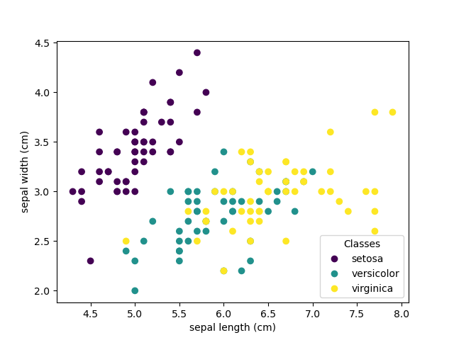

### k-Nearest neighbors classifier

The simplest possible classifier is the [nearest neighbor](https://en.wikipedia.org/wiki/K-nearest_neighbor_algorithm): given a new observation `X_test`, find in the training set (i.e. the data used to train the estimator) the observation with the closest feature vector. (Please see the [Nearest Neighbors section](https://scikit-learn.org/1.7/modules/neighbors.html#neighbors) of the online Scikit-learn documentation for more information about this type of classifier.)

Training set and testing set

While experimenting with any learning algorithm, it is important not to test the prediction of an estimator on the data used to fit the estimator as this would not be evaluating the performance of the estimator on **new data**. This is why datasets are often split into *train* and *test* data.

**KNN (k nearest neighbors) classification example**:

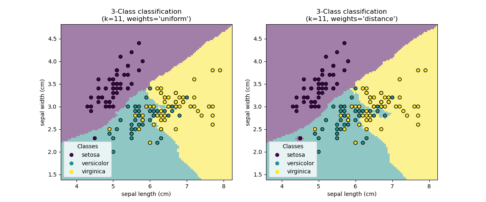

```python
>>> # Split iris data in train and test data
>>> # A random permutation, to split the data randomly
>>> np.random.seed(0)
>>> indices = np.random.permutation(len(iris_X))
>>> iris_X_train = iris_X[indices[:-10]]
>>> iris_y_train = iris_y[indices[:-10]]
>>> iris_X_test = iris_X[indices[-10:]]
>>> iris_y_test = iris_y[indices[-10:]]
>>> # Create and fit a nearest-neighbor classifier
>>> from sklearn.neighbors import KNeighborsClassifier
>>> knn = KNeighborsClassifier()
>>> knn.fit(iris_X_train, iris_y_train)
KNeighborsClassifier()
>>> knn.predict(iris_X_test)
array([1, 2, 1, 0, 0, 0, 2, 1, 2, 0])
>>> iris_y_test
array([1, 1, 1, 0, 0, 0, 2, 1, 2, 0])
```

### The curse of dimensionality

For an estimator to be effective, you need the distance between neighboring points to be less than some value

, which depends on the problem. In one dimension, this requires on average  points. In the context of the above -NN example, if the data is described by just one feature with values ranging from 0 to 1 and with  training observations, then new data will be no further away than . Therefore, the nearest neighbor decision rule will be efficient as soon as

 is small compared to the scale of between-class feature variations.

If the number of features is

, you now require  points.  Let’s say that we require 10 points in one dimension: now  points are required in  dimensions to pave the  space. As

 becomes large, the number of training points required for a good estimator grows exponentially.

For example, if each point is just a single number (8 bytes), then an effective

-NN estimator in a paltry

 dimensions would require more training data than the current estimated size of the entire internet (±1000 Exabytes or so).

This is called the [curse of dimensionality](https://en.wikipedia.org/wiki/Curse_of_dimensionality) and is a core problem that machine learning addresses.

## Linear model: from regression to sparsity

Diabetes dataset

The diabetes dataset consists of 10 physiological variables (age, sex, weight, blood pressure) measured on 442 patients, and an indication of disease progression after one year:

```python
>>> diabetes_X, diabetes_y = datasets.load_diabetes(return_X_y=True)
>>> diabetes_X_train = diabetes_X[:-20]
>>> diabetes_X_test  = diabetes_X[-20:]
>>> diabetes_y_train = diabetes_y[:-20]
>>> diabetes_y_test  = diabetes_y[-20:]
```

The task at hand is to predict disease progression from physiological variables.

### Linear regression

[`LinearRegression`](https://scikit-learn.org/1.7/modules/generated/sklearn.linear_model.LinearRegression.html#sklearn.linear_model.LinearRegression), in its simplest form, fits a linear model to the data set by adjusting a set of parameters in order to make the sum of the squared residuals of the model as small as possible.

Linear models:

: data

: target variable

: Coefficients

- : Observation noise

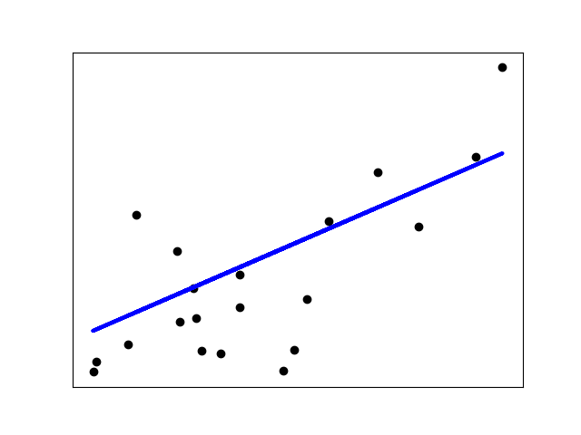

```python
>>> from sklearn import linear_model
>>> regr = linear_model.LinearRegression()
>>> regr.fit(diabetes_X_train, diabetes_y_train)
LinearRegression()
>>> print(regr.coef_)
[   0.30349955 -237.63931533  510.53060544  327.73698041 -814.13170937
  492.81458798  102.84845219  184.60648906  743.51961675   76.09517222]
>>> # The mean square error
>>> np.mean((regr.predict(diabetes_X_test) - diabetes_y_test)**2)
2004.5...

>>> # Explained variance score: 1 is perfect prediction
>>> # and 0 means that there is no linear relationship
>>> # between X and y.
>>> regr.score(diabetes_X_test, diabetes_y_test)
0.585...
```

### Shrinkage

If there are few data points per dimension, noise in the observations induces high variance:

```python
>>> X = np.c_[ .5, 1].T
>>> y = [.5, 1]
>>> test = np.c_[ 0, 2].T
>>> regr = linear_model.LinearRegression()

>>> import matplotlib.pyplot as plt
>>> plt.figure()
<...>
>>> np.random.seed(0)
>>> for _ in range(6):
...     this_X = .1 * np.random.normal(size=(2, 1)) + X
...     regr.fit(this_X, y)
...     plt.plot(test, regr.predict(test))
...     plt.scatter(this_X, y, s=3)
LinearRegression...
```

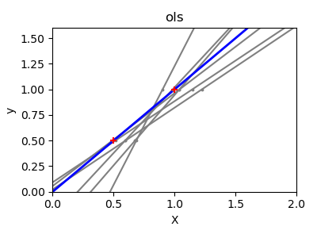

A solution in high-dimensional statistical learning is to *shrink* the regression coefficients to zero: any two randomly chosen set of observations are likely to be uncorrelated. This is called [`Ridge`](https://scikit-learn.org/1.7/modules/generated/sklearn.linear_model.Ridge.html#sklearn.linear_model.Ridge) regression:

```python
>>> regr = linear_model.Ridge(alpha=.1)

>>> plt.figure()
<...>
>>> np.random.seed(0)
>>> for _ in range(6):
...     this_X = .1 * np.random.normal(size=(2, 1)) + X
...     regr.fit(this_X, y)
...     plt.plot(test, regr.predict(test))
...     plt.scatter(this_X, y, s=3)
Ridge...
```

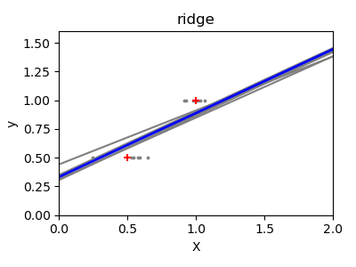

This is an example of **bias/variance tradeoff**: the larger the ridge `alpha` parameter, the higher the bias and the lower the variance.

We can choose `alpha` to minimize left out error, this time using the diabetes dataset rather than our synthetic data:

```python
>>> alphas = np.logspace(-4, -1, 6)
>>> print([regr.set_params(alpha=alpha)
...            .fit(diabetes_X_train, diabetes_y_train)
...            .score(diabetes_X_test, diabetes_y_test)
...        for alpha in alphas])
[0.585..., 0.585..., 0.5854..., 0.5855..., 0.583..., 0.570...]
```

Note

Capturing in the fitted parameters noise that prevents the model to generalize to new data is called [overfitting](https://en.wikipedia.org/wiki/Overfitting). The bias introduced by the ridge regression is called a [regularization](https://en.wikipedia.org/wiki/Regularization_(machine_learning)).

### Sparsity

**Fitting only features 1 and 2**

**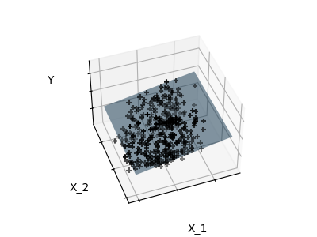 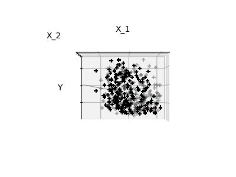 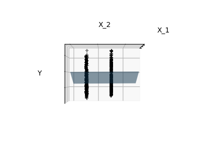**

Note

A representation of the full diabetes dataset would involve 11 dimensions (10 feature dimensions and one of the target variable). It is hard to develop an intuition on such representation, but it may be useful to keep in mind that it would be a fairly *empty* space.

We can see that, although feature 2 has a strong coefficient on the full model, it conveys little information on `y` when considered with feature 1.

To improve the conditioning of the problem (i.e. mitigating the [The curse of dimensionality](https://scikit-learn.org/1.7/tutorial/statistical_inference/supervised_learning.html#curse-of-dimensionality)), it would be interesting to select only the informative features and set non-informative ones, like feature 2 to 0. Ridge regression will decrease their contribution, but not set them to zero. Another penalization approach, called [Lasso](https://scikit-learn.org/1.7/modules/linear_model.html#lasso) (least absolute shrinkage and selection operator), can set some coefficients to zero. Such methods are called **sparse methods** and sparsity can be seen as an application of Occam’s razor: *prefer simpler models*.

```python
>>> regr = linear_model.Lasso()
>>> scores = [regr.set_params(alpha=alpha)
...               .fit(diabetes_X_train, diabetes_y_train)
...               .score(diabetes_X_test, diabetes_y_test)
...           for alpha in alphas]
>>> best_alpha = alphas[scores.index(max(scores))]
>>> regr.alpha = best_alpha
>>> regr.fit(diabetes_X_train, diabetes_y_train)
Lasso(alpha=0.025118864315095794)
>>> print(regr.coef_)
[   0.         -212.4...   517.2...  313.7... -160.8...
   -0.         -187.1...   69.3...  508.6...   71.8... ]
```

**Different algorithms for the same problem**

Different algorithms can be used to solve the same mathematical problem. For instance the `Lasso` object in scikit-learn solves the lasso regression problem using a [coordinate descent](https://en.wikipedia.org/wiki/Coordinate_descent) method, that is efficient on large datasets. However, scikit-learn also provides the [`LassoLars`](https://scikit-learn.org/1.7/modules/generated/sklearn.linear_model.LassoLars.html#sklearn.linear_model.LassoLars) object using the *LARS* algorithm, which is very efficient for problems in which the weight vector estimated is very sparse (i.e. problems with very few observations).

### Classification

For classification, as in the labeling [iris](https://en.wikipedia.org/wiki/Iris_flower_data_set) task, linear regression is not the right approach as it will give too much weight to data far from the decision frontier. A linear approach is to fit a sigmoid function or **logistic** function:


```python
>>> log = linear_model.LogisticRegression(C=1e5)
>>> log.fit(iris_X_train, iris_y_train)
LogisticRegression(C=100000.0)
```

This is known as [`LogisticRegression`](https://scikit-learn.org/1.7/modules/generated/sklearn.linear_model.LogisticRegression.html#sklearn.linear_model.LogisticRegression).

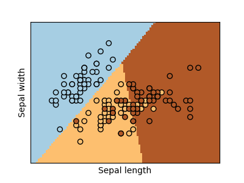

Multiclass classification

If you have several classes to predict, an option often used is to fit one-versus-all classifiers and then use a voting heuristic for the final decision.

Shrinkage and sparsity with logistic regression

The `C` parameter controls the amount of regularization in the [`LogisticRegression`](https://scikit-learn.org/1.7/modules/generated/sklearn.linear_model.LogisticRegression.html#sklearn.linear_model.LogisticRegression) object: a large value for `C` results in less regularization. `penalty="l2"` gives [Shrinkage](https://scikit-learn.org/1.7/tutorial/statistical_inference/supervised_learning.html#shrinkage) (i.e. non-sparse coefficients), while `penalty="l1"` gives [Sparsity](https://scikit-learn.org/1.7/tutorial/statistical_inference/supervised_learning.html#sparsity).

**Exercise**

Try classifying the digits dataset with nearest neighbors and a linear model. Leave out the last 10% and test prediction performance on these observations.

```python
from sklearn import datasets, linear_model, neighbors

X_digits, y_digits = datasets.load_digits(return_X_y=True)
X_digits = X_digits / X_digits.max()
```

A solution can be downloaded [`here`](https://scikit-learn.org/1.7/_downloads/e4d278c5c3a8450d66b5dd01a57ae923/plot_digits_classification_exercise.py).

## Support vector machines (SVMs)

### Linear SVMs

[Support Vector Machines](https://scikit-learn.org/1.7/modules/svm.html#svm) belong to the discriminant model family: they try to find a combination of samples to build a plane maximizing the margin between the two classes. Regularization is set by the `C` parameter: a small value for `C` means the margin is calculated using many or all of the observations around the separating line (more regularization); a large value for `C` means the margin is calculated on observations close to the separating line (less regularization).


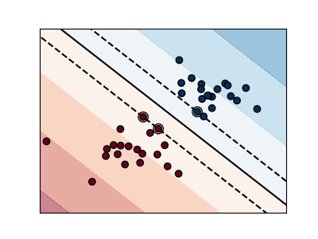

**Unregularized SVM**

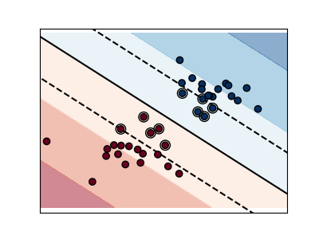

**Regularized SVM (default)**

Example:

- [Plot different SVM classifiers in the iris dataset](https://scikit-learn.org/1.7/auto_examples/svm/plot_iris_svc.html#sphx-glr-auto-examples-svm-plot-iris-svc-py)

SVMs can be used in regression –[`SVR`](https://scikit-learn.org/1.7/modules/generated/sklearn.svm.SVR.html#sklearn.svm.SVR) (Support Vector Regression)–, or in classification –[`SVC`](https://scikit-learn.org/1.7/modules/generated/sklearn.svm.SVC.html#sklearn.svm.SVC) (Support Vector Classification).

```python
>>> from sklearn import svm
>>> svc = svm.SVC(kernel='linear')
>>> svc.fit(iris_X_train, iris_y_train)
SVC(kernel='linear')
```

Warning

**Normalizing data**

For many estimators, including the SVMs, having datasets with unit standard deviation for each feature is important to get good prediction.

### Using kernels

Classes are not always linearly separable in feature space. The solution is to build a decision function that is not linear but may be polynomial instead. This is done using the *kernel trick* that can be seen as creating a decision energy by positioning *kernels* on observations:

#### Linear kernel

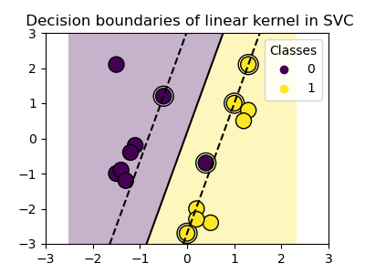

```python
>>> svc = svm.SVC(kernel='linear')
```

#### Polynomial kernel

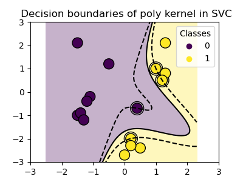

```python
>>> svc = svm.SVC(kernel='poly',
...               degree=3)
>>> # degree: polynomial degree
```

#### RBF kernel (Radial Basis Function)

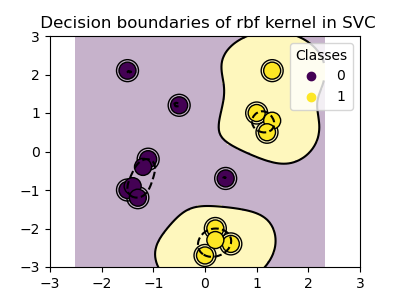

```python
>>> svc = svm.SVC(kernel='rbf')
>>> # gamma: inverse of size of
>>> # radial kernel
```

#### Sigmoid kernel

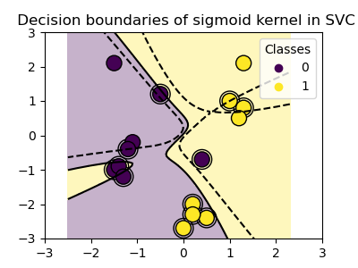

```python
>>> svc = svm.SVC(kernel='sigmoid')
```


**Interactive example**

See the [SVM GUI](https://scikit-learn.org/1.7/auto_examples/applications/svm_gui.html#sphx-glr-auto-examples-applications-svm-gui-py) to download `svm_gui.py`; add data points of both classes with right and left button, fit the model and change parameters and data.

**Exercise**

Try classifying classes 1 and 2 from the iris dataset with SVMs, with the 2 first features. Leave out 10% of each class and test prediction performance on these observations.

**Warning**: the classes are ordered, do not leave out the last 10%, you would be testing on only one class.

**Hint**: You can use the `decision_function` method on a grid to get intuitions.

```python
iris = datasets.load_iris()
X = iris.data
y = iris.target

X = X[y != 0, :2]
y = y[y != 0]
```


A solution can be downloaded [`here`](https://scikit-learn.org/1.7/_downloads/a3ad6892094cf4c9641b7b11f9263348/plot_iris_exercise.py)

## Enhanced Supervised Learning Features in scikit-learn 1.7

Since this tutorial was originally written for scikit-learn 1.4, several enhancements have been made to supervised learning capabilities:

### Enhanced Array API Support

scikit-learn 1.7 now supports Array API-compliant inputs, making it easier to work with data from libraries like PyTorch and CuPy directly in supervised learning tasks:

```python
>>> import torch
>>> from sklearn.linear_model import LinearRegression
>>> from sklearn.svm import SVC
>>>
>>> # Works with PyTorch tensors
>>> X = torch.tensor([[1, 2], [3, 4], [5, 6]])
>>> y = torch.tensor([3, 7, 11])
>>> reg = LinearRegression()
>>> reg.fit(X, y)  # Seamless integration with PyTorch
>>>
>>> # Also works with classification
>>> X_clf = torch.tensor([[1, 2], [2, 3], [3, 4], [4, 5]])
>>> y_clf = torch.tensor([0, 0, 1, 1])
>>> clf = SVC()
>>> clf.fit(X_clf, y_clf)
```

### Enhanced Sparse Data Support

All supervised learning estimators now support both traditional sparse matrices (`scipy.sparse.spmatrix`) and the newer sparse arrays (`scipy.sparse.sparray`):

```python
>>> from scipy.sparse import csr_array
>>> from sklearn.linear_model import LogisticRegression
>>> from sklearn.svm import SVC
>>>
>>> X_sparse = csr_array([[0, 1, 0], [1, 0, 1], [0, 1, 1]])
>>> y = [0, 1, 1]
>>>
>>> # Works with both sparse formats
>>> log_reg = LogisticRegression()
>>> log_reg.fit(X_sparse, y)
>>>
>>> svm_clf = SVC()
>>> svm_clf.fit(X_sparse, y)
```

### Enhanced Gradient Boosting for Supervised Learning

`HistGradientBoostingClassifier` and `HistGradientBoostingRegressor` now support explicit validation sets for better early stopping and overfitting control:

```python
>>> from sklearn.ensemble import HistGradientBoostingClassifier
>>> from sklearn.model_selection import train_test_split
>>>
>>> X_train, X_val, y_train, y_val = train_test_split(X, y, test_size=0.2)
>>> clf = HistGradientBoostingClassifier(enable_metadata_routing=True)
>>> clf.fit(X_train, y_train, X_val=X_val, y_val=y_val)
```

### Enhanced Multilayer Perceptron

The Multilayer Perceptron now supports Poisson loss (useful for count data) and sample weights, enhancing its flexibility for various supervised learning applications:

```python
>>> from sklearn.neural_network import MLPRegressor
>>>
>>> # Poisson loss for count data
>>> mlp_poisson = MLPRegressor(loss='poisson')
>>> mlp_poisson.fit(X_train, y_train)
>>>
>>> # Sample weights support
>>> sample_weights = np.array([1.0, 2.0, 1.5, 0.8])
>>> mlp_weighted = MLPRegressor()
>>> mlp_weighted.fit(X_train, y_train, sample_weight=sample_weights)
```

These enhancements maintain full backward compatibility while providing more flexibility and power for supervised learning tasks.


---

This original version of this tutorial was written by scikit-learn developers under the [BSD License](https://opensource.org/license/BSD-3-clause).  

---

The code examples and text were updated for scikit-learn version 1.7 by Brian Bird using Claude Sonet 4, 10/19/2025

---

